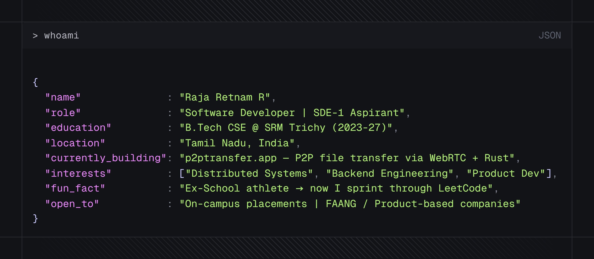
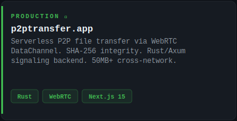
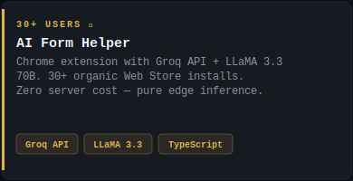
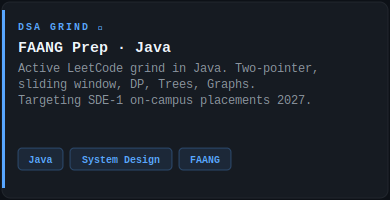
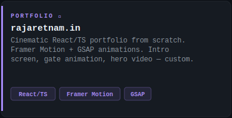

<div align="center">


<br/>


</div>

## `> whoami`

<div align="center">
  
</div>

---

## `> cat about.md`

<a href="https://p2ptransfer.app"></a><a href="https://chromewebstore.google.com/detail/quizbot-ai/eofcjnghgenmffccgkapnibajagkfoao"></a>

<a href="https://leetcode.com/u/Raja_retnam/"></a><a href="https://rajaretnam.in"></a>
---

## `> tech --stack`

### Languages
<p>

</p>

### Frontend
<p>

</p>

### Backend & Databases
<p>

</p>

### Tools & Cloud
<p>

</p>

---

## `> ls ./projects`

<table>
<tr>
<td width="50%" valign="top">

### 🦀 p2ptransfer.app


Serverless browser-to-browser P2P file transfer via **WebRTC DataChannel**. SHA-256 integrity verification. Cross-network transfer support. Signaling backend in **Rust/Axum** with WebSocket keep-alive.

`Rust` `Axum` `WebRTC` `Next.js 15` `WebSockets` `TypeScript`

</td>
<td width="50%" valign="top">

### 🤖 AI Form Helper


Chrome extension for intelligent form auto-completion using **Groq API + LLaMA 3.3 70B**. Batch-processes form fields. 30+ organic installs with zero paid promotion.

`Chrome APIs` `Groq API` `LLaMA 3.3 70B` `TypeScript`

</td>
</tr>
</table>

---

## `> contribution analytics`

<div align="center">


<br/><br/>


<br/><br/>


</div>

---


## `> current_focus`

```text
DSA (Java)            → Arrays, Trees, Graphs, Dynamic Programming
System Design         → HLD, LLD, Distributed Systems
Backend Engineering   → Rust, Axum, WebSockets
Full Stack Product    → Next.js 15, TypeScript, MongoDB
Interview Preparation → OS, DBMS, CN, OOP
```

---

## `> connect --all`

<div align="center">

[](https://www.linkedin.com/in/raja-retnam/)
&nbsp;
[](mailto:rajaretnam.rajasekar@gmail.com)
&nbsp;
[](https://rajaretnam.in)
&nbsp;
[](https://github.com/RajaretnamR)

</div>

---


